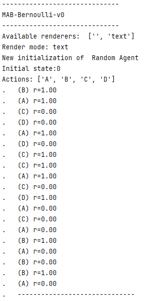
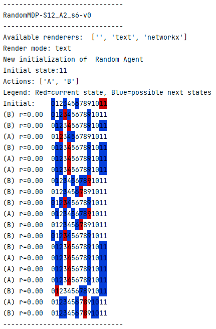
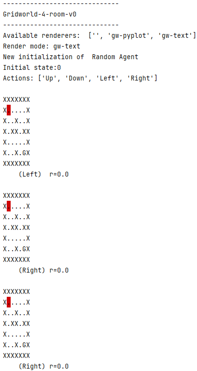
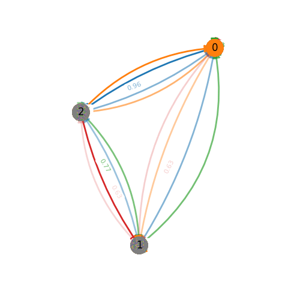
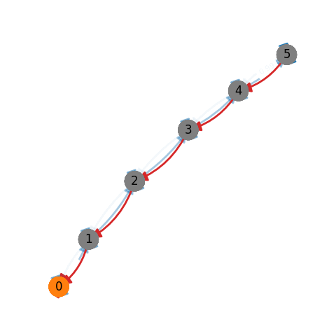
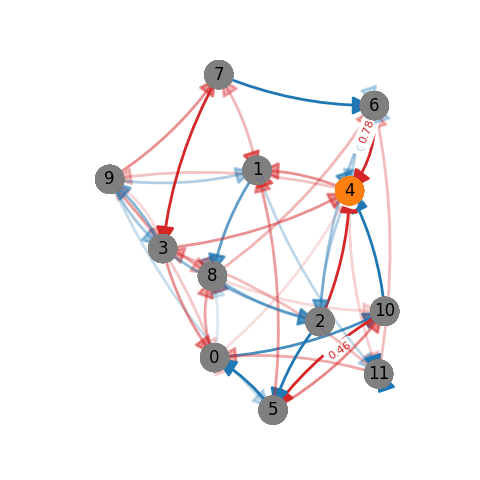
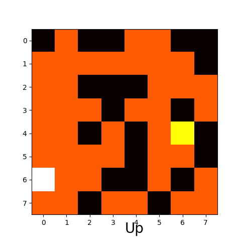
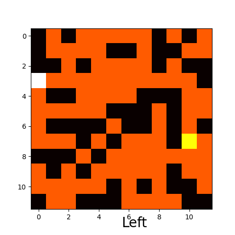

# Statistical Reinforcement Learning Environments
Environments for Statistical Reinforcement Learning

## Installation

bash setup.sh

## Test
python run.py

# List of environments:
    
    MABS:
        mab-bernoulli
    MDPs:
        random-rich
        ergodic-random-rich
        random-12
        random-small
        random-small-sparse
        random-100
        three-state
        nasty
        river-swim-6
        ergo-river-swim-6
        ergo-river-swim-25
        river-swim-25
    GRIDWORL MDPs:
        grid-random-1616
        grid-random-1212
        grid-random-88
        grid-2-room
        grid-4-room

# Rendering

Each type of environment comes with different renderers, 
including the null renderer that displays nothing.

## Text rendering:

 This rendering is available for all environment types.

### MAB Text rendering:

### MDP Text rendering:

### Gridworld-MDP Text rendering

# Graph rendering:

This rendering is available for MDPs. 
On top of the visual display, it captures a screenshot png at each time step. 
This may be slow for large MDPs.

### Grid-world rendering:

This rendering is available for Gridworld-MDPs.
On top of the visual display, it captures a screenshot png at each time step.

